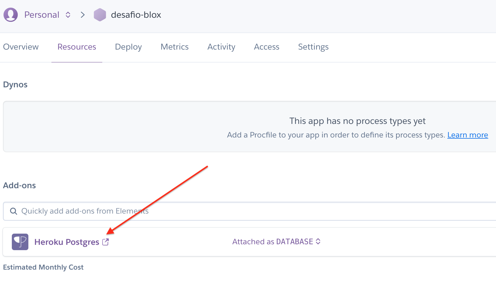

# Desafio - Ruby on Rails

  - [1) O que vou precisar](#1-o-que-vou-precisar)
    - [1.1) Instalar Docker](#11-instalar-docker)
    - [1.2) Instalar Rbenv](#12-instalar-rbenv)
  - [2) Rodando o Projeto](#2-rodando-o-projeto)
    - [2.1) Ambiente de Desenvolvimento](#21-ambiente-de-desenvolvimento)
    - [2.2) Ambiente de Test Rspec](#22-ambiente-de-test-rspec)
  - [3) Subindo para Produção](#3-subindo-para-produ%C3%A7%C3%A3)
    - [3.1) Add-Ons Heroku](#31-add-ons-heroku)
    - [3.2) Variaveis de Ambiente Heroku](#32-variaveis-de-ambiente-heroku)
    - [3.3) Adequando a Aplicação](#33-adequando-a-aplica%C3%A7%C3%A3o)
    - [3.4) Disponibilizando a Aplicação](#34-disponibilizando-a-aplica%C3%A7%C3%A3o)


## 1) O que vou precisar

Para a reprodução desse sistema é necessário ter alguns recursos instalado em sua máquina. O *Docker* se faz necessário, pois o bancos **Desenvolvimento** e **Test**, serão disponibilizado por essa ferramenta. Você pode rodar os 2 banco simuntaneamente pois cada banco roda em um contexto totalmente isolado e em portas diferentes. 

Já o *Rbenv* é responsável por gerenciar as versões de Ruby instalado em meu S.O, caso vc opte em usar outro gerenciador de Ruby, ou mesmo instalar nativamente a versão no seu S.O , funcionará perfeitamente. 

**Obs.: Caso opte por instalar o Ruby diretamente em seu S.O deverá instalar a versão do Ruby 2.4.7**

#### 1.1) Instalar Docker

* [Instalação do Docker](https://docs.docker.com/engine/install/)

#### 1.2) Instalar Rbenv

* [Instalação do Rbenv](https://github.com/rbenv/rbenv)

## 2) Rodando o Projeto

#### 2.1) Ambiente de Desenvolvimento

Após clonar o projeto para sua máquina, você deverá realizar alguns procedimentos. Ainda na pasta do projeto é necessário instalar todas as dependências que esse projeto precisa, subir o banco, popular as tabelas e dados iniciais.

#### Instalando Dependências

```bash
bundle isntall
```

#### Iniciando Banco de Development

O script abaixo se encarrega de subir um Banco Postgres na ultima versão 12, após a instância subir, cria-se um usuário , um banco, e um schema.

```sql
CREATE ROLE agenda WITH
	LOGIN
	NOSUPERUSER
	NOCREATEDB
	NOCREATEROLE
	INHERIT
	NOREPLICATION
	CONNECTION LIMIT -1
	PASSWORD '123456';

CREATE DATABASE blox_development
    WITH 
    OWNER = postgres
    ENCODING = 'UTF8'
    CONNECTION LIMIT = -1;

\connect blox_development;

CREATE SCHEMA agenda
    AUTHORIZATION agenda;
```

Os scripts bash abaixo, já realiza esses passos.

```bash
sh scripts_auxiliares/development/start.sh
sh scripts_auxiliares/development/database.sh
```

#### Migrates 

```bash
bundle exec rake db:migrate
```

#### Populando Dados Inicias

Para criar dados inicias , foi usado um recurso do rails que permite criar tarefas. Essa tarefa popula dados inicias que meu sistema precisa. Caso queira ver o conteúdo dessa task, basta acessar o diretório:
=> **lib** => **task** => **popular.rake**

```bash
bundle exec rake popular:dados
```

#### 2.2) Ambiente de Test Rspec

Para rodar os teste automatizados, vamos fazer isso em um banco separado. O banco de desenvolvimento roda na porta **5432** , já o banco de Teste roda na porta **5433**. 

#### Executando Rspec

O script abaixo, sobe um banco de Teste, popula o novo banco na nova instância do Postgres que roda na porta 5433, roda as migrates e logo apos roda os testes automatizados.

```bash
#!/usr/bin/env bash
set -e
cd $(dirname $0)
sh stop.sh
sh start.sh
sleep 5 
export PGPASSWORD=123456; psql -d postgres -U postgres -h localhost -p 5433 < database.sql
cd -
alias cp=cp
RAILS_ENV=test bundle exec rake db:migrate
RAILS_ENV=test bundle exec rspec
```

Para rodar os testes, basta executar esse comando abaixo. Os testes criado ficam disponível dentro da pasta **spec** => **models**

```bash
sh scripts_auxiliares/rspec/rspec.sh
```

## 3) Subindo para Produção

Se tudo que você fez saiu conforme o esperado, está na hora de irmos para produção. Primeiramente, deve-se criar uma conta dentro do portal do Heroku.

* [Heroku](https://heroku.com)

#### 3.1) Add-Ons Heroku

Um vez logado é necessário adicionar esse recurso, para que o banco possa ser disponibilizado dentro da estrutura do Heroku.



#### 3.2) Variaveis de Ambiente Heroku

Será necessário definir algumas variáveis de ambiente, essa variáveis serão utilizadas pela string de conexão com o Banco. Será necessário definir as seguintes variáveis de ambiente: **PG_HOST** , **PG_DATA**, **PG_USER**, **PG_PASS**

```yaml
production:
  <<: *default
  port: 5432
  host: <%= ENV['PG_HOST'] %>
  database: <%= ENV['PG_DATA'] %>
  username: <%= ENV['PG_USER'] %>
  password: <%= ENV['PG_PASS'] %>
  schema_search_path: public
```


#### 3.3) Adequando a Aplicação

No enviroment de produção devemos garantir que alguns parâmetros estejam configurados. Esses parâmetros é para dizer para aplicação quem irá gerar os assets, como os logs serão tratados la no heroku.

```ruby
  # Compress JavaScripts and CSS.
  config.assets.js_compressor = Uglifier.new(mangle: false, harmony: true)

  # Arquivos Estáticos
  config.public_file_server.enabled = ENV['RAILS_SERVE_STATIC_FILES'].present?

  # Logs
  if ENV["RAILS_LOG_TO_STDOUT"].present?
    logger           = ActiveSupport::Logger.new(STDOUT)
    logger.formatter = config.log_formatter
    config.logger    = ActiveSupport::TaggedLogging.new(logger)
  end
```

#### 3.4) Disponibilizando a Aplicação

* [Deploy no Heroku](https://devcenter.heroku.com/articles/getting-started-with-rails5)

```bash
heroku create
git config --list | grep heroku
git push heroku master
heroku run rake db:migrate
heroku run rake popular:dados
heroku ps:scale web=1
```

#### Mudando a Senha - Produção

```bash
heroku run rails c
user = User.find(1)
user.password = 'new password'
user.password_confirmation = 'new password'
user.save!
```

#### Acessando a aplicação

https://calm-dawn-36934.herokuapp.com